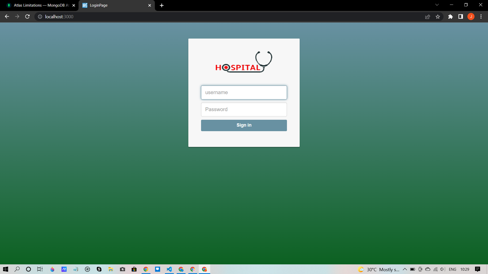
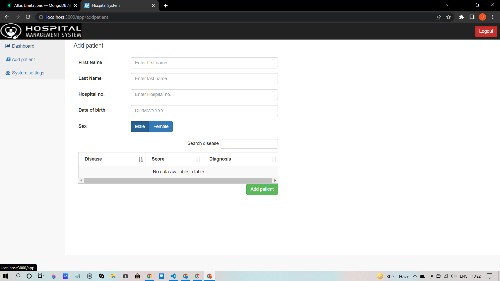
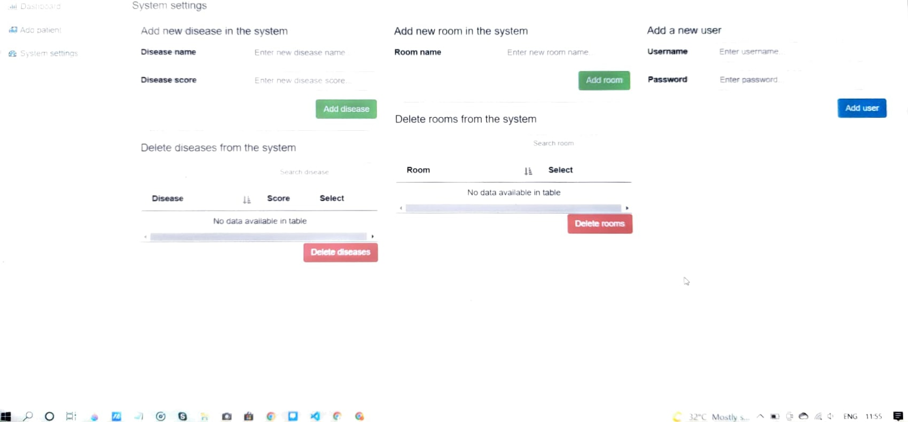

# Hospital-Management-System
- A web-based application designed to manage hospital operations efficiently, including patient records, staff information, appointments, and reports.

# About the Project
- This project is a Hospital Management System designed to streamline hospital operations. It offers functionalities such as patient registration, appointment scheduling, staff record management, and report generation. The front end is built using HTML, CSS, and JavaScript, while SQL manages the back-end database.

# Features
- Patient Management: Add, update, and manage patient records.
- Appointment Scheduling: Book and manage appointments.
- Staff Management: Maintain records of hospital staff.
- Report Generation: Generate reports for administrative purposes.
- User-Friendly Interface: Intuitive design for smooth navigation.
- Data Security: Implements basic data protection measures.

# Usage
- Open the website and navigate through the user-friendly interface.
- Use the Patient Management section to add or update patient details.
- Schedule or manage appointments in the Appointment Scheduling section.
- Maintain staff details via the Staff Management module.
- Generate reports from the Reports section for administrative use.

# Screenshots
- Login Page

- Home Page

- Patient Management Page

